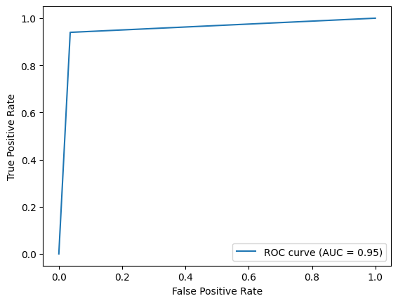

# Airline-Aviakompaniya-
Aviakompaniya yo'lovchilarining qoniqishini bashorat qilish
  
Faylni yuklab olib, Anaconda: Jupyter ,Google Colab, Visual Studio : Jupyter kabi code editor va online servislarda ishlatib ko'rish mumkin. 
Agar shu yerni o'zida online ishlatib ko'rishni istasangiz ,[" Aviakompaniya(customer_churn).ipynb "] fayliga kiring va " Open in colab " tugmasini bosing  
 <strong>Ishlatilgan DataSet </strong> [" aviakompaniya.zip "] faylida  
<strong>Datasetda Amerika Qo'shma Shtatlaridagi parvozlarga nisbatan yo'lovchilarning fikri haqida ma'lumotlar berilgan.</strong> 
<strong>Ushbu maʼlumotlar toʻplami quyidagilarni o'z ichiga oladi:</strong> 
<strong>Tarkib:</strong> 
* Gender: yo'lovchilarning jinsi (ayol, erkak)

* Customer Type: mijoz turi (sodiq mijoz, ishonchsiz mijoz)

* Age: yo'lovchilarning haqiqiy yoshi

* Type of Travel: yo'lovchilar parvozining maqsadi (shaxsiy sayohat, biznes sayohat)

* Class: yo'lovchilar samolyotida sayohat klassi (Business, Eco, Eco Plus)

* Flight distance: Ushbu sayohatning parvoz masofasi

* Inflight wifi service: Parvoz ichidagi Wi-Fi xizmatidan qoniqish darajasi (0: Tegishli emas; 1-5)

* Departure/Arrival time convenient: Ketish/Kelish vaqtining qoniqish darajasi

* Ease of Online booking: Onlayn bron qilishdan qoniqish darajasi

* Gate location: Darvoza joylashuvidan qoniqish darajasi

* Food and drink: Oziq-ovqat va ichimlikdan qoniqish darajasi

* Online boarding: Onlayn bortdan qoniqish darajasi

* Seat comfort: O'rindiqning qulayligidan qoniqish darajasi

* Inflight entertainment: Parvoz ichidagi o'yin-kulgidan qoniqish darajasi

* On-board service: Bort xizmatidan qoniqish darajasi

* Leg room service: oyoq xonasi xizmatidan qoniqish darajasi

* Baggage handling: bagajni tashishdan qoniqish darajasi

* Check-in service: Ro'yxatdan o'tish xizmatidan qoniqish darajasi

* Inflight service: Parvoz ichidagi xizmatdan qoniqish darajasi

* Cleanliness: Tozalikdan qoniqish darajasi

* Departure Delay in Minutes: jo‘nash vaqtida kechikish daqiqalari

* Arrival Delay in Minutes: yetib kelganda kechikish daqiqalari

* Satisfaction: Aviakompaniyaning qoniqish darajasi (qoniqish, neytral yoki norozilik)
  
<strong>Modelni yaratish uchun ishlatilgan algoritm :</strong>
* xgboost dan XGBClassifier

<strong>Model aniqligi :</strong> 
* accuracy_score - 0.952
* ROC curve :

  
<strong>Ishlatilgan texnologiya va modullar :</strong> 
<ul>
  <li>Python3</li>
  <li>pandas</li>
  <li>numpy</li>
  <li>sklearn</li>
  <li>matplotlib.pyplot</li>
  <li>seaborn</li>
  <li>xgboost</li>
</ul>
  
<strong>Sinab Ko'rildi :</strong> 
- Google Colab 
- 2024

